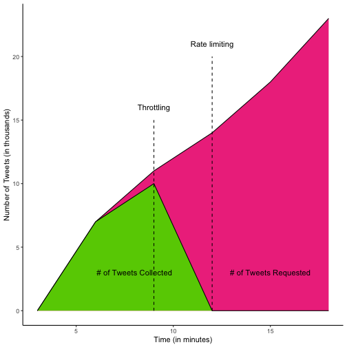

<style>

.reveal section p {
  color: black;
  font-size: .7em;
  font-weight: normal;
  font-family: 'Helvetica'; #this is the font/color of text in slides
}


.section .reveal .state-background {
    background: white;}
.section .reveal h1,
.section .reveal p {
    color: black;
    position: relative;
    font-family: 'Helvetica';
    font-weight: normal;
    top: 4%;}
   
 
 /* section titles */
.reveal h1 { 
  color: black;
  position: relative;
  font-weight: normal;
  font-family: 'Helvetica'; 
  top: 4%
}    

 
/* slide titles */
.reveal h3 { 
  color: black;
  font-weight: normal;
  font-family: 'Helvetica'; 
}    

.small-code pre code {
  font-size: 1.2em;
}

</style>


APIs
========================================================
author: Chris Bail 
date: Duke University
autosize: true
transition: fade  
  Website: https://www.chrisbail.net  
  Twitter: https://www.twitter.com/chris_bail  
  Github: https://github.com/cbail  


What Is an Application Programming Interface?
========================================================


What Is an Application Programming Interface?
========================================================


Growth of APIS
========================================================


More than >22,000 APIs!
========================================================


https://www.programmableweb.com/apis/directory 
&nbsp;  

https://any-api.com/


How Does an API Work?
========================================================
&nbsp;


Google Maps API Example
========================================================


Anatomy of an API Call
========================================================


Output of API call:
========================================================


Designing your Own API Calls
========================================================

Designing your Own API Calls
========================================================
&nbsp;


API Credentials
========================================================


Example: Facebook API
========================================================
&nbsp;

Navigate to:

https://developers.facebook.com/tools/explorer?classic=0


Example: Facebook API
========================================================


Rate Limiting
========================================================


Rate Limiting
========================================================


Throttling
========================================================




An Example with Twitter's API
========================================================

Navigate to:

http://developer.twitter.com


developer.twitter.com
========================================================


Get Started
========================================================


Create App
========================================================


App Dashboard
========================================================


App-lication
========================================================


Callback URL
========================================================
&nbsp;

http://127.0.0.1:1410


The Waiting Is the Hardest Part...
========================================================


=
Your Developer Console
========================================================


Keys and Access Tokens
========================================================


The rtweet Package
========================================================
&nbsp;

Developed by the heroic [Michael Kerney](https://mikewk.com/about/)


```r
install.packages("rtweet")
```


Define Your Credentials
========================================================
class: small-code


```r
# load rtweet

library(rtweet)

# create credentials as objects (these are FAKE CREDENTIALS)
# you need to replace them with your own.

api_key <- "aafghaioeriokjasfkljhsa"
api_secret_key <- "234897234kasdflkjashk"

# replace "my_awesome_app" with the name of YOUR app below

token <- create_token(
  app = "my_awesome_app",
  consumer_key = api_key,
  consumer_secret = api_secret_key)

# after you run the code above, a browser window will open asking you to authorize the app. 
# Once you do, you can begin making calls
```


Your First API Call
========================================================
class: small-code
&nbsp;

```r
covid_19_tweets<-search_tweets("coronavirus", n=4000)
```


Browse the Results
========================================================
&nbsp;

```r
names(covid_19_tweets)
```


Browse the Results
========================================================
&nbsp;

```r
head(covid_19_tweets$text)
```


Browse the Results
========================================================


Plot Results by Time
========================================================
class: small-code


```r
ts_plot(covid_19_tweets, "secs") +
  ggplot2::theme_minimal() +
  ggplot2::theme(plot.title = ggplot2::element_text(face = "bold")) +
  ggplot2::labs(
    x = NULL, y = NULL,
    title = "Frequency of Tweets about Covid-19 Around 1pm, May 3, 2020",
    subtitle = "Tweet counts aggregated by second",
    caption = "\nSource: Data collected from Twitter's REST API via rtweet"
  )
```

Plot Results by Time
========================================================


Next, Let's Search by Location
========================================================
class: small-code
&nbsp;

```r
covid_geo_tweets <- search_tweets("coronavirus",
  "lang:en", geocode = lookup_coords("usa"), 
  n = 3000, type="recent", include_rts=FALSE
  )
geocoded <- lat_lng(covid_geo_tweets)
```


Plot
========================================================
class: small-code
&nbsp;


```r
par(mar = c(0, 0, 0, 0))
maps::map("world", lwd = .25)
with(geocoded, points(lng, lat, pch = 20, cex = .50, col = rgb(0, .3, .7, .75)))
```


Plot
========================================================
&nbsp;


Get Tweets from Individual Account
========================================================
class: small-code
&nbsp;

```r
trump_tweets <- get_timelines(c("realDonaldTrump
"), n = 5)
head(trump_tweets$text)
```

Five Trump Tweets
========================================================
&nbsp;


Get General Information About a User
========================================================
class: small-code
&nbsp;

```r
obama_twitter_profile <- lookup_users("BarackObama")
```


Browse Fields
========================================================
class: small-code
&nbsp;

```r
obama_twitter_profile$description
```


Browse Fields
========================================================
class: small-code
&nbsp;

```r
obama_twitter_profile$location
```

Browse Fields
========================================================
class: small-code
&nbsp;

```r
obama_twitter_profile$followers_count
```


Get Users' Favorites
========================================================
class: small-code
&nbsp;

```r
obama_favorites<-get_favorites("BarackObama", n=5)
```


Get Networks
========================================================
class: small-code
&nbsp;

```r
watts_followers<-get_followers("duncanjwatts")
```


Check Rate Limits
========================================================
&nbsp;

```r
rate_limits<-rate_limit()
head(rate_limits[50:55,1:4])
```

Check Rate Limits
========================================================
&nbsp;


Get Trending Topics by Location
========================================================
&nbsp;

```r
get_trends("New York")
```


rtweet can even post tweets!
========================================================
&nbsp;

```r
post_tweet("This Lecture is SICSS-xy")
```
&nbsp;  

**Note: this is a very useful function if you are building a bot**

Wrapping API Calls within a Loop
========================================================


There Are R Packages for Other APIs
========================================================
&nbsp;

Here are a few: **`RgoogleMaps`, `googlelanguageR`,`rOpenSci,  `WDI`,`rOpenGov`,`rtimes`**

Many more are available but not yet on CRAN (install from github or using devtools)


A SICSS-sourced list of APIs for CSS
========================================================
&nbsp;

https://docs.google.com/spreadsheets/d/1ZEr3okdlb0zctmX0MZKo-gZKPsq5WGn1nJOxPV7al-Q/edit?usp=sharing


APIs Also do Analyses!
========================================================
&nbsp;

For example, visualization **`plotly`** 


Challenges of Working with APIs
========================================================

